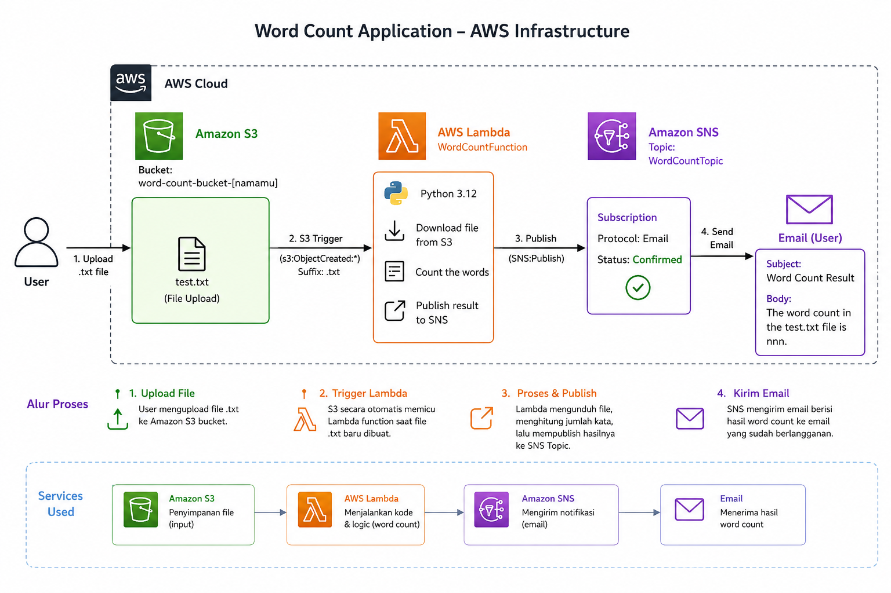

# AWS Lambda Word Count Processing Pipeline

An automated, event-driven serverless pipeline designed to process text files uploaded to Amazon S3, compute the total word count using AWS Lambda, and notify users of the result via Amazon SNS email notifications.

---

## Architecture Overview


1. **Ingestion Layer:** A text file (`.txt`) is uploaded to a dedicated Amazon S3 bucket.
2. **Compute Layer:** The S3 upload event (`s3:ObjectCreated:*`) automatically triggers an AWS Lambda function (`WordCountFunction`).
3. **Execution & Processing:** The Lambda function fetches the object content from S3, decodes the UTF-8 text, and parses the exact word count.
4. **Messaging Layer:** The computed result is formatted into a standardized message string and published to an Amazon SNS Topic (`WordCountTopic`).
5. **Notification Layer:** Amazon SNS broadcasts the message to all confirmed email endpoints associated with the topic subscription.

---

## Technical Features and Capabilities

- **Event-Driven Automation:** Eliminates manual polling by binding S3 object creation events directly to Lambda invocations.
- **Stateless Serverless Execution:** Runs on-demand without persistent infrastructure, minimizing operational cost and idle capacity.
- **Strict Input Filtering:** Configured with S3 event suffix rules (`.txt`) to isolate relevant file types and prevent unintended triggers.
- **Identity and Access Governance:** Utilizes least-privilege service roles (`LambdaAccessRole`) granting explicit permissions across S3, SNS, and CloudWatch.

---

## AWS Services and Dependencies

- **Amazon S3:** Serves as the primary object storage for incoming document uploads.
- **AWS Lambda:** Hosts and executes the core Python 3.12 processing logic asynchronously.
- **Amazon SNS:** Handles pub/sub messaging and final email delivery to end-users.
- **AWS IAM:** Provides execution authorization via the pre-configured `LambdaAccessRole`.
- **Amazon CloudWatch:** Captures execution logs, errors, and performance metrics for auditing.
- **Boto3 SDK:** Python library used inside Lambda for interacting with AWS services.


---

## Core Lambda Function Implementation

The Python script below is hosted at `src/lambda_function.py` and serves as the core handler for the pipeline.

```python
import json
import urllib.parse
import boto3

s3 = boto3.client('s3')
sns = boto3.client('sns')

# Replace with your actual Amazon SNS Topic ARN
SNS_TOPIC_ARN = 'arn:aws:sns:REGION:ACCOUNT_ID:WordCountTopic'

def lambda_handler(event, context):
    try:
        # Extract bucket name and decoded object key from event trigger
        bucket = event['Records'][0]['s3']['bucket']['name']
        key = urllib.parse.unquote_plus(event['Records'][0]['s3']['object']['key'], encoding='utf-8')

        # Retrieve file content from S3
        response = s3.get_object(Bucket=bucket, Key=key)
        content = response['Body'].read().decode('utf-8')

        # Parse string and compute total words
        words = content.split()
        word_count = len(words)

        # Construct required output format
        message = f"The word count in the {key} file is {word_count}."
        subject = "Word Count Result"

        # Publish payload to SNS topic
        sns.publish(
            TopicArn=SNS_TOPIC_ARN,
            Message=message,
            Subject=subject
        )

        return {
            'statusCode': 200,
            'body': json.dumps(f'Success! Processed {key} with {word_count} words.')
        }

    except Exception as e:
        print(f"Error processing object {key} from bucket {bucket}: {e}")
        raise e
