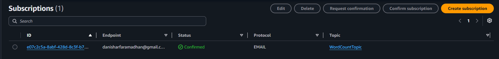
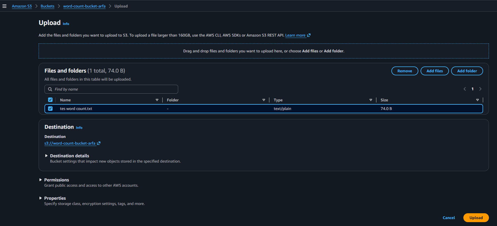
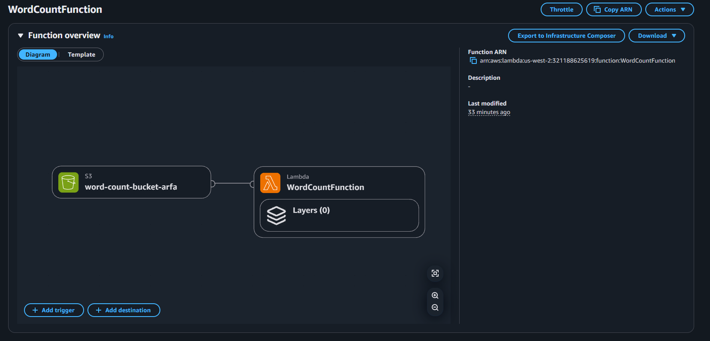
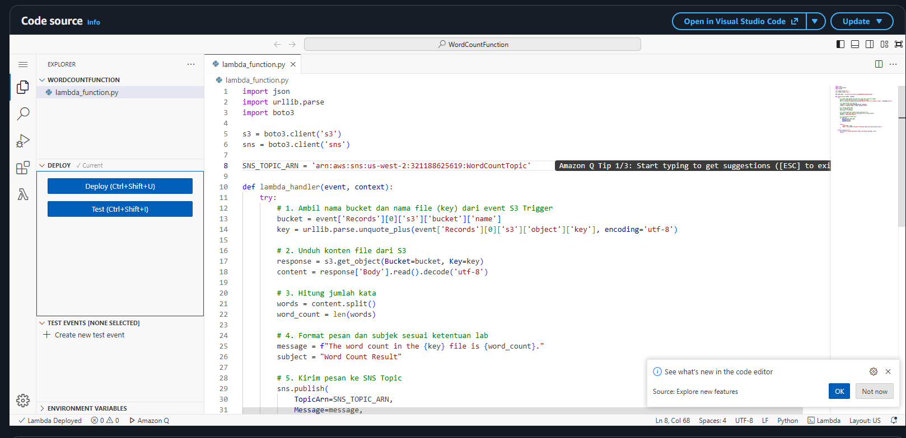
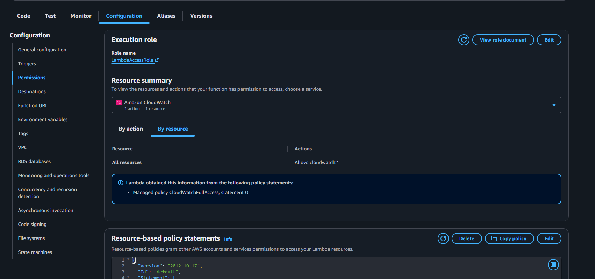
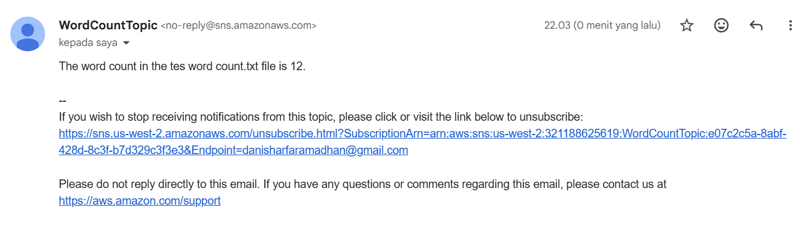

# AWS Lambda Word Count Processing Pipeline

An automated, event-driven serverless pipeline designed to process text files uploaded to Amazon S3, compute the total word count using AWS Lambda, and notify users of the result via Amazon SNS email notifications.

---

## Architecture Overview

```text
+------------------+         +--------------------+         +--------------------+         +------------------+
|   Amazon S3      |         |     AWS Lambda     |         |     Amazon SNS     |         |  Email Inbox     |
| (File Upload)    | ------> | (Word Count Logic) | ------> |  (Notification)    | ------> |  (Notification)  |
+------------------+         +--------------------+         +--------------------+         +------------------+
```


1. **Ingestion Layer:** A text file (`.txt`) is uploaded to a dedicated Amazon S3 bucket.
2. **Compute Layer:** The S3 upload event (`s3:ObjectCreated:*`) automatically triggers an AWS Lambda function (`WordCountFunction`).
3. **Execution & Processing:** The Lambda function fetches the object content from S3, decodes the UTF-8 text, and parses the exact word count.
4. **Messaging Layer:** The computed result is formatted into a standardized message string and published to an Amazon SNS Topic (`WordCountTopic`).
5. **Notification Layer:** Amazon SNS broadcasts the message to all confirmed email endpoints associated with the topic subscription.

---

## Technical Features and Capabilities

- **Event-Driven Automation:** Eliminates manual polling by binding S3 object creation events directly to Lambda invocations.
- **Stateless Serverless Execution:** Runs on-demand without persistent infrastructure, minimizing operational cost and idle capacity.
- **Strict Input Filtering:** Configured with S3 event suffix rules (`.txt`) to isolate relevant file types and prevent unintended triggers.
- **Identity and Access Governance:** Utilizes least-privilege service roles (`LambdaAccessRole`) granting explicit permissions across S3, SNS, and CloudWatch.

---

## AWS Services and Dependencies

- **Amazon S3:** Serves as the primary object storage for incoming document uploads.
- **AWS Lambda:** Hosts and executes the core Python 3.12 processing logic asynchronously.
- **Amazon SNS:** Handles pub/sub messaging and final email delivery to end-users.
- **AWS IAM:** Provides execution authorization via the pre-configured `LambdaAccessRole`.
- **Amazon CloudWatch:** Captures execution logs, errors, and performance metrics for auditing.
- **Boto3 SDK:** Python library used inside Lambda for interacting with AWS services.

---

## Project Directory Structure

```text
aws-lambda-wordcount/
├── src/
│   └── lambda_function.py
├── images/
│   ├── 00-infrastructure.png
│   ├── 01-sns-subscription-confirmed.png
│   ├── 02-s3-bucket-uploaded-file.png
│   ├── 03-lambda-function-overview.png
│   ├── 04-lambda-python-code.png
│   ├── 05-lambda-execution-role.png
│   └── 06-email-result-notification.png
└── README.md
```

---

## Core Lambda Function Implementation

The Python script below is hosted at `src/lambda_function.py` and serves as the core handler for the pipeline.

```python
import json
import urllib.parse
import boto3

s3 = boto3.client('s3')
sns = boto3.client('sns')

# Replace with your actual Amazon SNS Topic ARN
SNS_TOPIC_ARN = 'arn:aws:sns:REGION:ACCOUNT_ID:WordCountTopic'

def lambda_handler(event, context):
    try:
        # Extract bucket name and decoded object key from event trigger
        bucket = event['Records'][0]['s3']['bucket']['name']
        key = urllib.parse.unquote_plus(event['Records'][0]['s3']['object']['key'], encoding='utf-8')

        # Retrieve file content from S3
        response = s3.get_object(Bucket=bucket, Key=key)
        content = response['Body'].read().decode('utf-8')

        # Parse string and compute total words
        words = content.split()
        word_count = len(words)

        # Construct required output format
        message = f"The word count in the {key} file is {word_count}."
        subject = "Word Count Result"

        # Publish payload to SNS topic
        sns.publish(
            TopicArn=SNS_TOPIC_ARN,
            Message=message,
            Subject=subject
        )

        return {
            'statusCode': 200,
            'body': json.dumps(f'Success! Processed {key} with {word_count} words.')
        }

    except Exception as e:
        print(f"Error processing object {key} from bucket {bucket}: {e}")
        raise e
```

---

## Screenshots and Proof of Work

### 1. Amazon SNS Topic Creation and Subscription

A Standard SNS Topic (`WordCountTopic`) was created to serve as the notification bus. An email protocol subscription was attached to the topic. To ensure delivery integrity, the email endpoint was manually verified, changing the subscription status from `PendingConfirmation` to `Confirmed`.



*Figure 1: Amazon SNS Topic console displaying the confirmed email subscription state.*

---

### 2. Amazon S3 Bucket Provisioning

An S3 bucket was created in the same region to store input files. The bucket serves as the event source for the automation pipeline. Sample `.txt` files were uploaded to validate bucket object storage and event emission.



*Figure 2: Amazon S3 console displaying uploaded sample text files ready for processing.*

---

### 3. Lambda Event Trigger Integration

The Lambda function `WordCountFunction` was configured with an S3 event trigger. The trigger listens specifically for `s3:ObjectCreated:*` events. A suffix filter (`.txt`) was applied to ensure only text files trigger function execution, avoiding unnecessary execution costs.



*Figure 3: AWS Lambda Function Overview showing S3 integrated as the event trigger source.*

---

### 4. Source Code Deployment

The processing logic was written in Python 3.12 using `boto3`. The function reads the incoming S3 object key, downloads the content into memory, splits the raw string into word tokens, and invokes the SNS `publish` API using the target Topic ARN.



*Figure 4: AWS Lambda code editor showing deployed Python source code.*

---

### 5. Execution Role and IAM Governance

To perform cross-service operations, the Lambda function was configured with `LambdaAccessRole`. This execution role provides permissions required for reading S3 objects, publishing SNS messages, and writing logs to Amazon CloudWatch.



*Figure 5: Lambda configuration panel displaying attached execution role permissions.*

---

### 6. End-to-End Verification and Output

Testing was performed by uploading a text file (`test.txt`) to the S3 bucket. The event triggered the Lambda execution, which counted the words and published an SNS notification. The resulting email verified the pipeline's end-to-end functionality.



*Figure 6: Email notification received showing correct subject line and formatted word count output.*

---

## Validation Summary

- **Trigger Test:** File upload automatically invoked Lambda within seconds.
- **Log Inspection:** CloudWatch logs confirmed successful execution with HTTP 200 responses.
- **Output Validation:** Email subject matched `Word Count Result` and the body correctly stated: `The word count in the test.txt file is nnn.`
